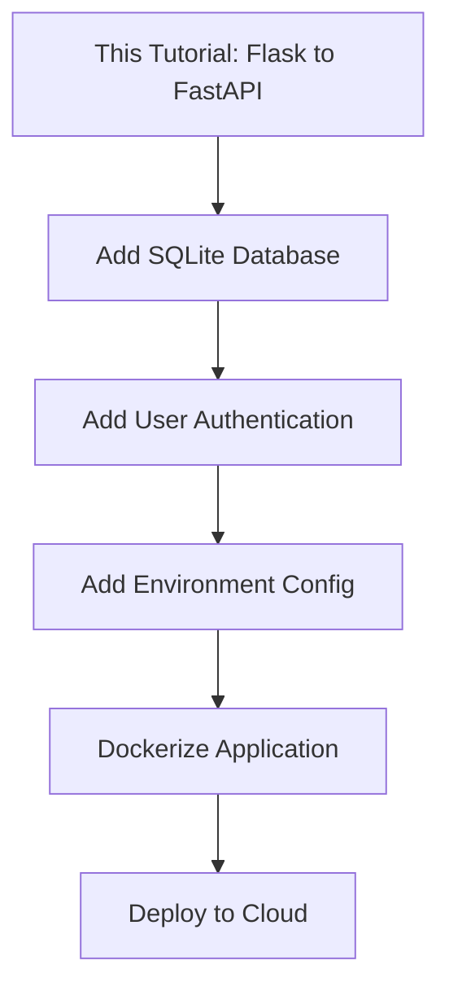

# Step-by-Step FastAPI Conversion Plan

This plan outlines a methodical approach to converting the Flask Todo app to FastAPI, designed for learning purposes with verification at each step.

## Conversion Philosophy

**Key Principles:**
1. **One step at a time** - Convert incrementally, test after each change
2. **Document as we go** - Create .md files explaining each phase
3. **Learn by doing** - Understand WHY we make each change
4. **Verify progress** - Start the server and test after each phase

## Project Overview

### Current Flask Application Structure
```
flask-todo/
├── app.py                 # Flask app with 91 lines
├── requirements.txt       # Flask dependencies
├── templates/
│   ├── index.html        # List all todos
│   ├── create.html       # Create new todo form
│   └── edit.html         # Edit existing todo form
├── static/css/main.css   # Tailwind CSS styles
└── plans/                # Documentation
```

### Target FastAPI Structure
```
flask-todo/
├── app.py                 # Keep original (renamed or removed later)
├── main.py               # NEW: FastAPI application
├── models.py             # NEW: Pydantic data models
├── requirements.txt      # UPDATED: FastAPI dependencies
├── templates/            # UPDATED: Minor url_for changes
│   ├── index.html
│   ├── create.html
│   └── edit.html
├── static/css/main.css   # UNCHANGED
└── plans/
    └── step-X-*.md       # NEW: Learning documentation
```

---

## Phase 1: Foundation Setup

### What We'll Do
1. Create [`models.py`](../models.py) with Pydantic data models
2. Create [`main.py`](../main.py) with basic FastAPI setup
3. Update [`requirements.txt`](../requirements.txt) for FastAPI
4. Write documentation explaining the setup

### Files to Create/Modify
- `models.py` (NEW)
- `main.py` (NEW - basic skeleton)
- `requirements.txt` (MODIFY)
- `plans/step-1-foundation.md` (NEW)

### Verification Steps
```bash
# Install new dependencies
pip install -r requirements.txt

# Start FastAPI server
uvicorn main:app --reload --port 8000

# Verify: Visit http://localhost:8000/docs
# You should see the Swagger UI (even if empty)
```

### Learning Points
- Pydantic models vs Python dictionaries
- FastAPI application initialization
- Static files and templates setup
- uvicorn vs Flask development server

---

## Phase 2: API Routes Conversion

### What We'll Do
Convert the JSON API endpoints first (easier, no templates involved):
1. `GET /todos` - List all todos
2. `GET /todos/{id}` - Get single todo

### Files to Modify
- `main.py` (ADD API routes)
- `plans/step-2-api-routes.md` (NEW)

### Verification Steps
```bash
# Keep server running with --reload

# Test via Swagger UI: http://localhost:8000/docs
# OR use curl:
curl http://localhost:8000/todos
curl http://localhost:8000/todos/1
```

### Learning Points
- Route decorator differences: `@app.route()` vs `@app.get()`
- Path parameters: `<int:id>` vs `{id}: int`
- Response models and automatic JSON serialization
- HTTPException for error handling
- Automatic API documentation

---

## Phase 3: Web Interface Routes

### What We'll Do
Convert the HTML-serving routes (requires template integration):
1. `GET /` - Index page showing all todos
2. `GET /create` - Show create form
3. `POST /create` - Handle form submission
4. `GET /edit/{id}` - Show edit form
5. `POST /edit/{id}` - Handle edit form
6. `GET /delete/{id}` - Delete todo and redirect

### Files to Modify
- `main.py` (ADD web routes)
- `plans/step-3-web-routes.md` (NEW)

### Verification Steps
```bash
# Test in browser: http://localhost:8000/
# - Verify todo list displays
# - Test create form
# - Test edit form
# - Test delete functionality
```

### Learning Points
- `Jinja2Templates` in FastAPI
- Form handling with `Form(...)`
- `RedirectResponse` with proper status codes
- Request object in template context
- GET vs POST route separation

---

## Phase 4: Template Updates

### What We'll Do
Update Jinja2 templates for FastAPI compatibility:
- Change `url_for('static', filename=...)` to `url_for('static', path=...)`

### Files to Modify
- `templates/index.html` (MODIFY)
- `templates/create.html` (MODIFY)
- `templates/edit.html` (MODIFY)
- `plans/step-4-templates.md` (NEW)

### Verification Steps
```bash
# Refresh browser - verify CSS still loads correctly
# Check browser console for any 404 errors
```

### Learning Points
- Flask vs FastAPI url_for differences
- Starlette's StaticFiles integration
- Template context requirements

---

## Phase 5: Convert Tests to FastAPI

### What We'll Do
Convert the existing Flask tests to FastAPI's TestClient:
1. Update test imports and setup
2. Add tests for API endpoints
3. Add tests for form submissions
4. Document testing approach

### Files to Modify
- `test_app.py` (MODIFY - convert to FastAPI TestClient)
- `plans/step-5-testing.md` (NEW)

### Flask Test (Current)
```python
import unittest
from app import app, todos

class AppTestCase(unittest.TestCase):
    def setUp(self):
        app.config["TESTING"] = True
        self.app = app.test_client()

    def test_create_todo(self):
        response = self.app.post(
            "/create",
            data=dict(title="Test Todo", description="This is a test todo"),
            follow_redirects=True,
        )
        self.assertEqual(response.status_code, 200)
```

### FastAPI Test (Converted)
```python
import pytest
from fastapi.testclient import TestClient
from main import app, todos

@pytest.fixture
def client():
    todos.clear()  # Reset state before each test
    return TestClient(app)

def test_create_todo(client):
    response = client.post(
        "/create",
        data={"title": "Test Todo", "description": "This is a test todo"},
        follow_redirects=True,
    )
    assert response.status_code == 200

def test_get_todos_api(client):
    # First create a todo
    client.post("/create", data={"title": "Test", "description": "Test"})
    
    # Then fetch via API
    response = client.get("/todos")
    assert response.status_code == 200
    assert len(response.json()) == 1

def test_delete_todo(client):
    client.post("/create", data={"title": "Test", "description": "Test"})
    response = client.get("/delete/1", follow_redirects=True)
    assert response.status_code == 200
```

### Verification Steps
```bash
# Run tests with pytest
pytest test_app.py -v

# Expected output: All tests pass
```

### Learning Points
- pytest vs unittest
- FastAPI TestClient usage
- Testing forms with `data=` parameter
- Testing API endpoints with JSON
- Test fixtures for state management

---

## Phase 6: Final Testing & Cleanup

### What We'll Do
1. Complete end-to-end testing
2. Write final documentation
3. Optional: Remove Flask app.py

### Verification Checklist
- [ ] Homepage loads with styling
- [ ] Can create new todo
- [ ] Can edit existing todo
- [ ] Can delete todo
- [ ] API endpoints return JSON at /todos
- [ ] Swagger docs available at /docs
- [ ] ReDoc available at /redoc

### Files to Create
- `plans/step-5-final.md` (NEW - completion summary)

---

## Quick Reference: Key Differences

### Route Decorators
```python
# Flask
@app.route("/todos/<int:id>", methods=["GET", "POST"])

# FastAPI
@app.get("/todos/{id}")
@app.post("/todos/{id}")
```

### Form Data
```python
# Flask
title = request.form["title"]

# FastAPI
async def create(title: str = Form(...)):
```

### Redirects
```python
# Flask
return redirect(url_for("index"))

# FastAPI
return RedirectResponse(url="/", status_code=303)
```

### Templates
```python
# Flask
return render_template("index.html", todos=todos)

# FastAPI
return templates.TemplateResponse("index.html", {"request": request, "todos": todos})
```

### Static Files URL
```html
<!-- Flask -->
{{url_for('static', filename='css/main.css')}}

<!-- FastAPI -->
{{ url_for('static', path='/css/main.css') }}
```

---

## Estimated Progress Markers

| Phase | Verification | What Works |
|-------|-------------|------------|
| 1 | `/docs` loads | Empty Swagger UI |
| 2 | `/todos` returns JSON | API endpoints only |
| 3 | `/` shows HTML | Full web interface |
| 4 | CSS loads correctly | Complete styling |
| 5 | Tests pass | Automated validation |
| 6 | All features work | Complete application |

---

## Production Considerations

This conversion is designed for **learning purposes**. Here's what would be needed for a production-ready app:

### What This App Has - Learning Level
- ✅ Basic CRUD operations
- ✅ Web interface with forms
- ✅ API endpoints with JSON
- ✅ Automatic API documentation
- ✅ Type validation with Pydantic
- ✅ Basic unit tests

### What Production Would Need - Future Learning

| Category | Current | Production Requirement |
|----------|---------|----------------------|
| **Data Storage** | In-memory list - lost on restart | Database such as PostgreSQL or SQLite with SQLAlchemy |
| **Authentication** | None | JWT tokens, OAuth, session management |
| **Configuration** | Hardcoded values | Environment variables, .env files |
| **Error Handling** | Basic exceptions | Logging, error tracking with Sentry |
| **Security** | None | HTTPS, CORS, rate limiting, CSRF |
| **Deployment** | Local dev server | Docker, Gunicorn, cloud hosting |
| **Monitoring** | None | Health checks, metrics, alerts |

### Learning Path After This Tutorial



### Example: Adding a Database - Future Step
```python
# This would be a natural next step after completing this tutorial
from sqlalchemy import create_engine
from sqlalchemy.orm import sessionmaker

DATABASE_URL = "sqlite:///./todos.db"
engine = create_engine(DATABASE_URL)
SessionLocal = sessionmaker(autocommit=False, autoflush=False, bind=engine)

# Dependency injection for database sessions
def get_db():
    db = SessionLocal()
    try:
        yield db
    finally:
        db.close()
```

---

## Summary

### Updated Phase Overview

| Phase | Focus | Documentation |
|-------|-------|---------------|
| 1 | Foundation - models and setup | `step-1-foundation.md` |
| 2 | API Routes - JSON endpoints | `step-2-api-routes.md` |
| 3 | Web Routes - HTML pages | `step-3-web-routes.md` |
| 4 | Templates - url_for changes | `step-4-templates.md` |
| 5 | Testing - pytest and TestClient | `step-5-testing.md` |
| 6 | Final verification and cleanup | `step-6-final.md` |

### Files We Will Create or Modify

**New Files:**
- `main.py` - FastAPI application
- `models.py` - Pydantic data models
- `plans/step-1-foundation.md` through `step-6-final.md` - Learning documentation

**Modified Files:**
- `requirements.txt` - Add FastAPI dependencies
- `templates/*.html` - Update url_for syntax
- `test_app.py` - Convert to FastAPI TestClient

**Untouched Files:**
- `app.py` - Keep original Flask app for comparison
- `static/css/main.css` - No changes needed

---

## Ready to Start?

Begin with **Phase 1: Foundation Setup** by switching to Code mode to create the initial files.
